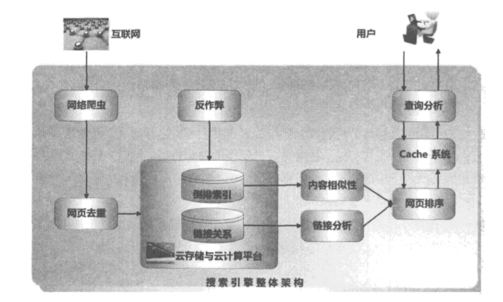
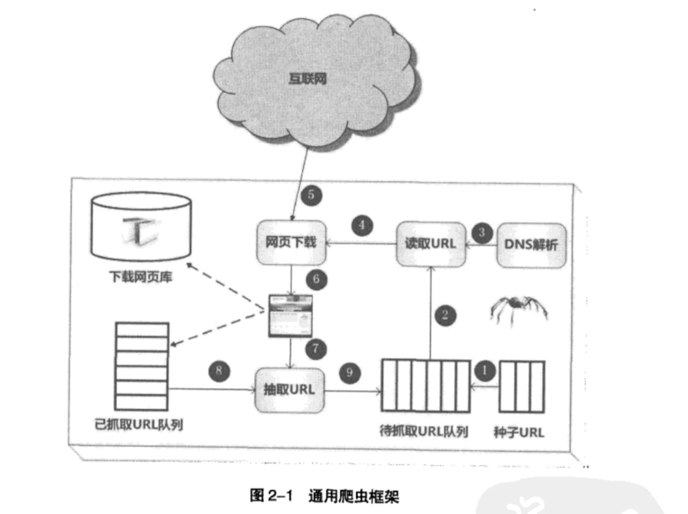
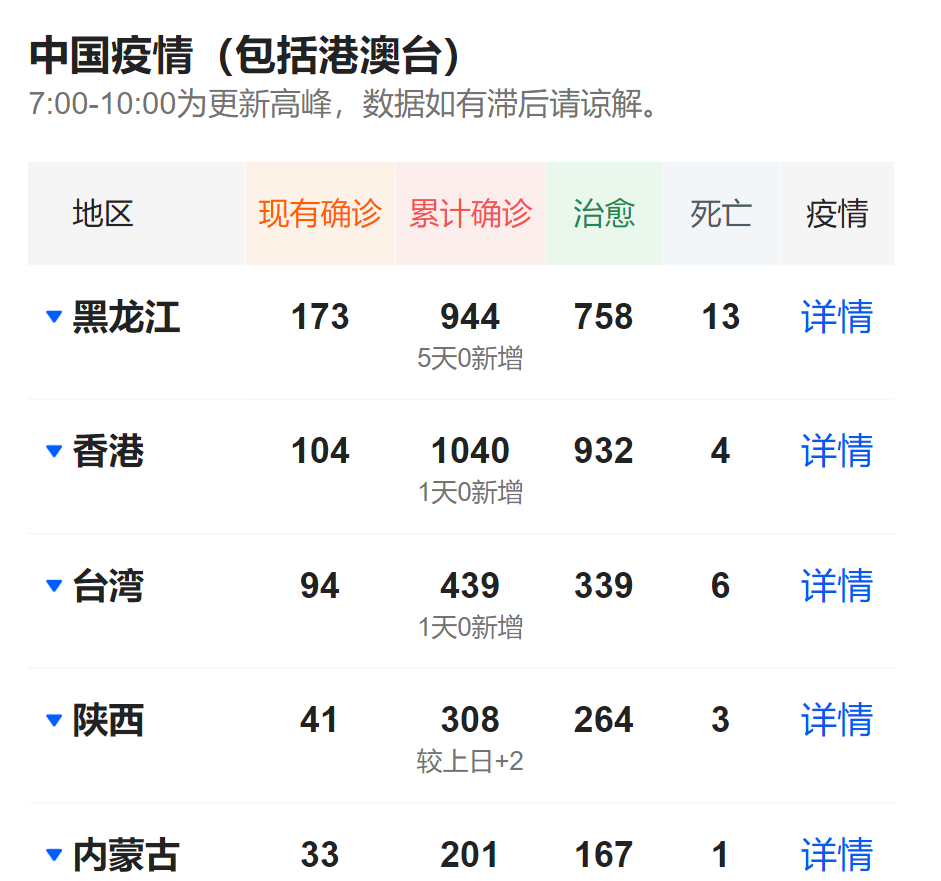
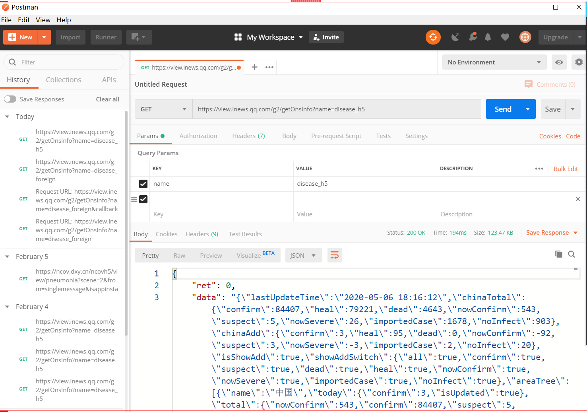

## Day 1

#### 【课程目标】

1） spring boot的常见应用
2） 业务功能的开发思路
3） 爬虫的底层原理
4） 对技术的应用有一定思考


#### 【项目的诞生】

项目成员：项目经理 PM
产品经理 PD、 UI设计师 UED、 前端工程师 FE、后端工程师 RD、
测试工程师 QA、运维工程师 OP


#### 【功能的诞生】

产品经理 ->  需求评审会  ->  UI设计师（交互） ->  UI评审 ->  技术 ->  技术方案设计 ->  开发（1/3） ->  测试和修改


#### 【爬虫的基础知识】

（一） 搜索引擎

“搜索引擎”     是一种帮助用户搜索他们需要内容的计算机程序

本质：连接人与内容     




（二）爬虫分类

通用型爬虫（搜索引擎使用）   

​        采集的数据是整个网站的数据，不论数据是何种形态、格式，使用通用的方法来存储和处理

垂直型爬虫（对特定内容的采集）

​        采集的数据是指定的，格式是指定的，使用个性化的方法来处理




（三）爬虫数据的分析

1、浏览器开发者工具

分析数据源
1） 腾讯新闻出品
 https://news.qq.com/zt2020/page/feiyan.htm#/?nojump=1 

2）丁香医生出品
 https://ncov.dxy.cn/ncovh5/view/pneumonia?scene=2&clicktime=1579579384&enterid=1579579384&from=singlemessage&isappinstalled=0 

工具的打开方式：F12 / Ctrl + Shift + I / 更多工具 - 开发者工具 /  右键 - 检查

选中Network - Preserve log（保存持续的日志）， 重新刷新页面，可以看到网页所有的请求连接和返回数据。


想拿到表格中   国内疫情的数据情况




分析的方式：
通过搜索框，搜索想要获得数据的具体数值，如：944/758等等

分析后的请求地址：
https://view.inews.qq.com/g2/getOnsInfo?name=disease_h5 

返回数据的格式是json


2、postman（模拟http请求的工具）

验证分析出来的请求地址，在排除上下文环境后，是否依然能够拿到数据。

比如有的请求，依赖cookie、依赖动态的参数等等




## Day 2

#### 【解析数据】

##### (一)  认识JSON

JSON = JavaScript Object Notation   （JavaScript对象表示法）

本质上，是存储和交换文本信息的语法。是一种轻量级的文本数据格式。


java领域内解析json的工具：gson 、 fastjson 、jackson


JSON 和 Java实体类

| JSON        | JAVA实体类                    |
| ----------- | ----------------------------- |
| string      | java.lang.String              |
| number      | java.lang.Number (Double)     |
| true\|false | java.lang.Boolean             |
| null        | null                          |
| array       | java.util.List (ArrayList)    |
| object      | java.util.Map (LinkedTreeMap) |


##### (二) Gson

是google推出的，用来在json数据和java对象之间进行转换的类库。

```
Gson  gson = new Gson();
Gson  gson1 = new GsonBuilder().create();

// 将对象obj转化为json字符串
String jsonStr = gson.toJson(Obj);
// 将json字符串转化为java对象
T obj = gson.fromJson(jsonStr,class)
```


使用方式

1）引入gson依赖

```
<!-- https://mvnrepository.com/artifact/com.google.code.gson/gson -->
        <dependency>
            <groupId>com.google.code.gson</groupId>
            <artifactId>gson</artifactId>
            <version>2.8.6</version>
        </dependency>
```

2）确认要转化的数据格式

```
import lombok.AllArgsConstructor;
import lombok.Data;

@Data @AllArgsConstructor
public class DataBean {

    private String area;
    private int nowConfirm;
    private int confirm;
    private int heal;
    private int dead;
}

```

3）解析文本数据

```
public class DataHandler {

    public static void main(String[] args) throws Exception{
        getData();
    }


    public static List<DataBean> getData() throws Exception {
//        Gson gson = new Gson();
////        Gson gson1 = new GsonBuilder().create();
//        Map map = gson.fromJson(testStr,Map.class);
//        System.out.println(map);


        // 读取文件中的文本内容   然后再转化为java对象
//        File file = new File("tmp.txt");

        FileReader fr = new FileReader("tmp.txt");
        char[] cBuf = new char[1024];
        int cRead = 0;
        StringBuilder builder = new StringBuilder();
        while ((cRead = fr.read(cBuf)) > 0) {
            builder.append(new String(cBuf, 0, cRead));
        }

        fr.close();

//        System.out.println(builder.toString());
        Gson gson = new Gson();
        Map map = gson.fromJson(builder.toString(), Map.class);
        System.out.println(map);

        ArrayList areaList = (ArrayList) map.get("areaTree");
        Map dataMap = (Map) areaList.get(0);
        ArrayList childrenList = (ArrayList) dataMap.get("children");

        // 遍历然后转化
        List<DataBean> result = new ArrayList<>();

        for (int i = 0; i < childrenList.size(); i++) {
            Map tmp = (Map) childrenList.get(i);
            String name = (String)tmp.get("name");

            Map totalMap = (Map) tmp.get("total");
            double nowConfirm = (Double)totalMap.get("nowConfirm");
            double confirm = (Double)totalMap.get("confirm");
            double heal = (Double)totalMap.get("heal");
            double dead = (Double)totalMap.get("dead");

            DataBean dataBean = new DataBean(name,(int)nowConfirm,(int)confirm,
                    (int)heal,(int)dead);

            result.add(dataBean);
        }

        System.out.println(result);

        return result;
    }
}

```

##### (三)  将数据展示在页面中


